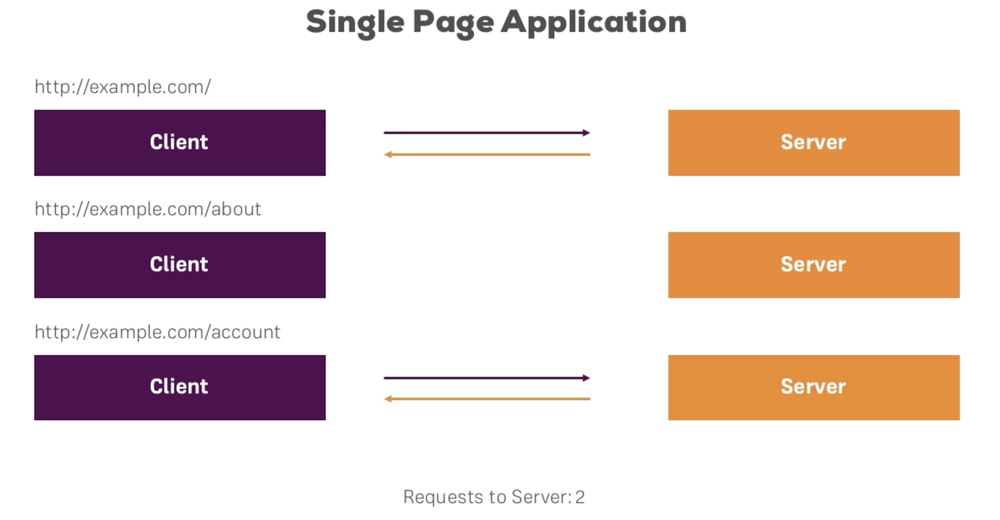

# ANGULAR 2 - PLAYGROUND

## Section 1

### Introduction
#### Section 1 - Lecture 1
- Debugging
- Setup
- Data-binding
- Components
- Routing
- Services
- Directives
- Dependency Injection
- Forms
- Authentication
- Http
- Angular 2 CLI
- Pipes

### What is Angular 2?
#### Section 1 - Lecture 2
#### Angular 2 is a Framework for Creating Single Page Applications (SPA)
##### Traditional Web Applications
```
User {=> } Client { request => , Response <= } Server
svg.com/ { => , <= } Server
svg.com/about { => , <= } Server
svg.com/account { => , <= } Server
```


##### Single Page Applications
```
User { => , <= } Client { request => , Response <= } Server
svg.com/ { => , <= } Server
svg.com/about { => , <= } Client
svg.com/account { => , <= } Server
```




### Creating an Angular 2 Project
#### Section 1 - Lecture 3
Install angular cli npm module
```
$ sudo npm install -g angular-cli
$ ng new first-app
```
 ng serve - start up server on angular Applications
 ```
 $ ng serve
 ```
go to browser http://localhost:4200/

### Got Setup Issues (with Angular 2 CLI)?
#### Section 1 - Lecture 4
In this course I'll use the CLI. I **recommend using it** as it makes the creation and management of Angular 2 projects very easy.

The CLI still is in beta and therefore it works for most students but some also experience issues. If you got some issues try these steps (use `sudo`  on Mac and Linux):

```
[sudo] npm uninstall -g angular-cli
npm cache clean
[sudo] npm install -g angular-cli@latest
(notice the @latest addition - this might fix your installation issues)
```

To get fast support with any more errors,  make sure to browse Q&A section on the installation video - or google any "angular cli YOUR ERROR MESSAGE" => Chances are high to find a solution to your issue!

But if you still got problems installing it (it still is in beta after all) or want to try out/ use a different setup, you may have a look at the following seed project: https://github.com/mgechev/angular2-seed

Follow the instructions on this page to set it up and use it. The folder structure follows a similar approach as the CLI - you're going to work in the `src/client/app`  folder (CLI: `src/app` ).

Be aware that you won't be able to use the ng commands (like `ng generate component` ) but as I show and discuss all the files generated by the CLI, that shouldn't be an issue. You'll have to create such files on your own, but you will be able to do so.

If you're using this seed because the CLI doesn't work, you may occasionally check for updates of the CLI (explained in section 16 of this course).

### Editing our First App
#### Section 1 - Lecture 5
`first-app/src/app` is where all of the app mainly lives

### Understanding the Project Structure
#### Section 1 - Lecture 6
- e2e folder is used for end to end testing
- src folder is where you're going to write some code
- app/shared has shared Components
- app.component.ts file
- app.componenent.spec.ts is for unit testing
- app template in app.component.html
- app styling in app.component.css
- app.module.ts bundle to show what parts the angular app has
- index.ts keeps track of all the other files to make importing easier.
- environments folder and files stores environmental variables which are needed for the compilation of the app
- main.ts is what starts the ng Application
- styles.css is for defining global styles
- angular-cli.json allows you to configure angular specific files
- karma.conf.js and protractor.conf.js are used for testing

### Why TypeScript? What is TypeScript? (w/ Cheat Sheet)
#### Section 1 - Lecture 7
- Types
- Classes
- Modules
- and More!

TypeScript compiles to JS


##### Install TypeScript
```
$ [sudo] npm install typescript -g
```

### Understanding the TypeScript Code
#### Section 1 - Lecture 8

In case you feel lost with all that TypeScript code - here's a brief article to get you started with it. Note that I have a complete TypeScript module in this course.

You may also come back to this article after the next few videos :).

The important thing first: All files have `.ts` as file extension because we write TypeScript code in these files.

If you never saw TypeScript before it might look strange, but it's actually only JavaScript + extra Features. You can write any JS code in a TypeScript file and it will work!
```
import { Component } from '@angular/core';
@Component({
    selector: 'app-root',
    templateUrl: 'app.component.html',
    styleUrls: ['app.component.css']
})
export class AppComponent {
    title = 'I changed it!';
}
```
##### Imports

First, we import code from another module. In this case, it's an Angular 2 module (as you can tell by the `@angular` ), but that might also be one of our own modules.

Now what is a module? Basically everything you export can be called "a module". You could also simply refer to it as "some code".

One important note here is: No matter if you import some `@angular`  package/ module or code from your own file, you never add the file extension in the import.

For example, an import from your own file would look like this (you'll see this in later videos):

`import { MyOtherComponent } from 'myother.component';`

See? No `.ts`  at the end!

##### Decorators (`@Component` )  

Decorators are basically functions which get attached to other code - in this case to a class. A decorator simply leads to the execution of some code in the background which "does something". Here, the `@Component()`  decorator takes a JavaScript object as an argument and uses this argument to add some metadata (in the background) to this class.

That makes this class a Component which Angular 2 can recognize.

Angular 2 uses Decorators a lot (not only for Components) and you may simply keep in mind that Decorators "do something in the background and transform whatever they are attached to, to something else Angular 2 knows (like a Component)".

##### class

Classes is a feature added by TypeScript which makes the creation of objects easier. You can think of a class as a blueprint for JS objects. Note that you rarely instantiate classes (= create objects based on them) yourself in an Angular 2 app. Most of the time, Angular 2 will do that for you.

##### Types

Something you don't see in the above code, but TypeScript has its name because you can assign Types to properties, variables etc.

A type declaration looks like this:

`someProperty: string = 'Hello';`

This makes sure that only string values may be assigned to someProperty.

## Section 2

### Components, Templates & Data-binding
#### Section 2 - Lecture 9


### Creating a new Component
#### Section 2 - Lecture 14
```
$ ng generate component other
```
### Using multiple Components
#### Section 2 - Lecture 6
```
$ cd src/app/other
$ ng g c another
$ ng g c another --flat -is -it
```

### view Encapsulation & Styling
#### Section 2 - Lecture 18

##### The Shdow DOM - not supported in all browsers

##### Angular 2 Emulation


### Databinding Overview
#### Section 2 - Lecture 20


### Databinding Overview
#### Section 2 - Lecture 20

### Databinding Overview
#### Section 2 - Lecture 20

### Databinding Overview
#### Section 2 - Lecture 20

### Databinding Overview
#### Section 2 - Lecture 20

### Databinding Overview
#### Section 2 - Lecture 20

### Databinding Overview
#### Section 2 - Lecture 20

### Databinding Overview
#### Section 2 - Lecture 20

### Databinding Overview
#### Section 2 - Lecture 20

### Databinding Overview
#### Section 2 - Lecture 20
